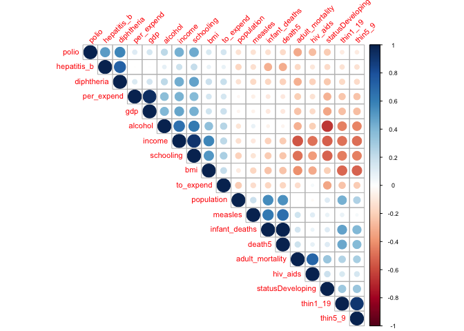
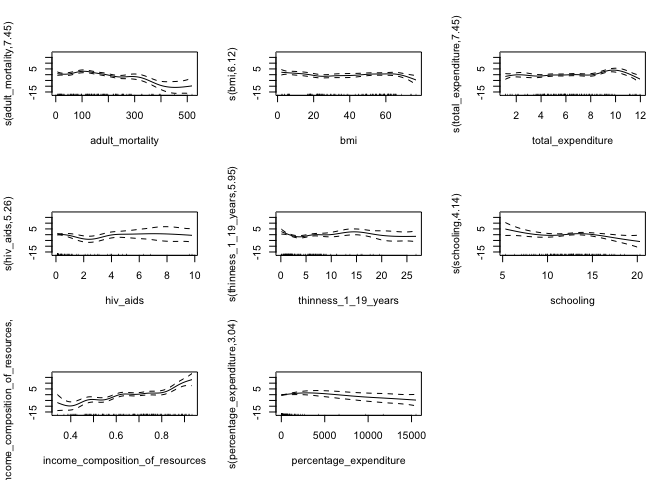
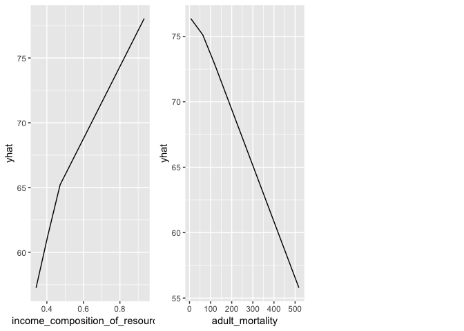
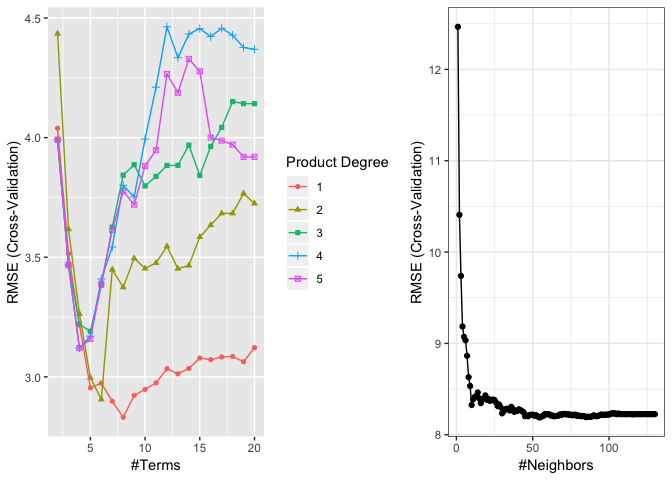
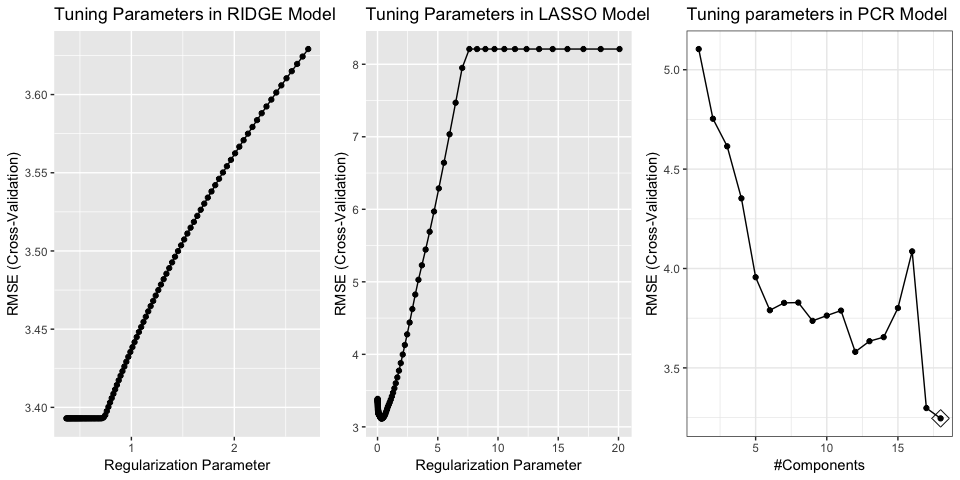
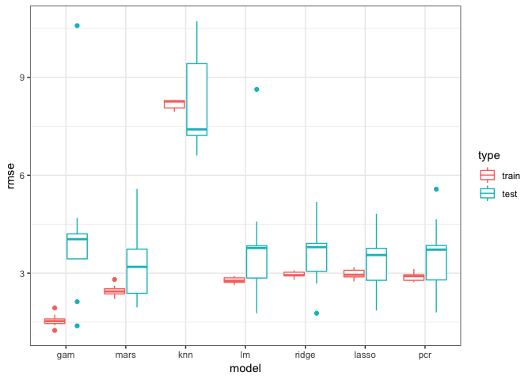

Predicting Country-Level Life Expectancy in 2013
================
Jianghui Lin jl5172, Zixu Wang zw2541, Jack Yan xy2395
4/5/2019

Introduction
------------

This dataset includes the immunization factors, mortality factors, economic factors, social factors and other health-related factors from 193 countries in 2013.Although there have been a lot of studies undertaken in the past on factors affecting life expectancy considering demographic variables, income composition, and mortality rates. It was found that effect of immunization and human development index was not taken into account in the past. Hence, this gives the motivation to resolve both the factors stated previously by formulating a regression model based on linear regression and non-linear regression. Important immunization like Hepatitis B, Polio and Diphtheria will also be considered.

Since the observations this dataset is based on different countries, we can use the analysis results to determine which predicting factors contribute to lower life expectancy. This information would be helpful for government and related agencies to serve their residents better and thus improve their life expectancy. We decided to focus on data collected in 2013 and omit any observation with NA values. After cleaning, we have 130 valid observations.

Exploratory Data Analysis
-------------------------

According to the correlation plot above, we have found several interesting correlations between different variables. For example, Hepatitis B (HepB) immunization coverage has strong positive correlation with Diphtheria tetanus toxoid and pertussis (DTP3) immunization coverage, Gross Domestic Product(GDP) has a strong positive correlation with Expenditure on health(per\_expand) and BMI has a strong positive correlation with income, etc. We have determined to take care of these correlations in later analysis.

Screening for near-zero variables: We haven’t found any near zero variables in our dataset. Therefore, we decided to continue further analysis on all variables.

Models
------

**Write some overall descriptions here.**

Both non-linear models (GAM, KNN and MARS) and linear models (Ridge, lasso, and PCR) were built on all the data to analyse the relationship between life expenctancy and the predictors. 10-fold cross-validation was conducted to find the optimal tuning parameter(s) in KNN, MARS, Ridge, the lasso, and PCR. Since we only have 19 variables, we did not do any variable selection prior to model-building, and let the model decide which variables should be included. The only exception is for GAM, where the variables were selected manually based on GCV.

### Non-linear Models

#### *GAM*

GAM was used to model the non-linear relation between predictors and response, which might be closer to the truth than those given by linear models. With our small sample size (n = 130) and large number of predictors (p = 19), it is impossible to use `caret::train` to do automatic variable selection, because the model would have more coefficients than data. Instead, we manually selected 8 most important variables from all the 19 variables according to GCV score. The plot shows that `income_composition_of_resources`, `adult_mortality`, and `total_expenditure` are the most influential non-linear predictors.

#### *KNN*

All the 19 predictors were included in the KNN model. The optimal tuning parameter k = 6 was chosen with minimum RMSE by 10-fold cross-validation. The importance of variables was obtained by `VarImp` function. Using all the data, the top 5 most important variables are `income_composition_of_resources`, `schooling`, `hiv_aids`, `adult_mortality`, and `bmi`.

#### *MARS*

Using 10-fold cross-validation, we found the optimal model with 6 retained terms and 1 degree of interaction. Among the 6 retained variables, `income_composition_of_resources` and `adult_mortality` contribute most to the reduction of residual sums of squares (RSS) and GCV score.

### Linear Models

We created four types of linear models here and the assumptions are shown below:

-   Linearity: The variables and response actually exhibit a linear relationship.

-   Independency: Observations should be independent.

-   Homoscedasticity: For each value of the predictor (x), the variance of the response(Y) should be the same.

-   Normality: For each value of the predictor (x), the distribution of the response(Y) is normal. The errors should be normally distributed.

#### *Linear model using least squares*

We included all predictors for least square. The least square model is relatively simple and applicable which based on maximum-likelihood solution. The best linear unbiased estimators can be obtained if Gauss-Markov conditions applied. By checking the p-value (test of whether each coefficient equals to zero) of each predictor, we found first significant predictors are `hiv_aids` and `income_composition_of_resources`, second significant predictor is `total_expenditure`.

#### *Ridge*

All predictor variables were included. The tuning parameters were picked from a grid of *λ* value from -1 to 1 with length=100. The 10-fold cross-validation was performed in order to pick the value of tuning parameter—the *λ* with the smallest error. Using the varlmp() function, we found that `income_composition_of_resources`, `status Developing`, `hiv_aids`, `schooling`, `total_expenditure` are more significant than other variables.

#### *Lasso*

All predictor variables were included. The 10-fold cross-validation was performed in order to pick the value of tuning parameter—the *λ* with the smallest error. Only 9 of 19 variables were involved in this model, and the variables like `income_composition_of_resources`, `hiv_aids` and `total_expenditure` are considered more significant than the other predictors.

#### *PCR*

All predictor variables were included. The 10-fold cross-validation was performed in order to pick the value of tuning parameter with the smallest error. The significant variables in PCR include `Income_composition_of_resources`, `schooling`, `hiv_aids`, `adult_mortality`.

Model Comparison By Cross-Validation
------------------------------------

To compare model predictive performance, 10-fold cross-validation was performed. Tuning parameters were decided by 10-fold cross-validation using the training data set. RMSE was obtained using the testing data set.

The above plot shows the distribution of RMSE in the 10 folds. Among the nonlinear models, GAM fits the training data most closely, but MARS has the overall best prediction performance. The KNN model has both the highest training and the highest testing RMSE, showing lack of fit and predictability. The 4 linear models have similar performance, among which lasso has the lowest mean RMSE. Overall, MARS generates the lowest RMSE, so it has the best performance for our data. It is worth noting, however, that the range of RMSE for MARS model is wider than the linear models. Therefore, linear models may have a more stable performace than non-linear models for our data.

Discussion
----------

**Interpretation and Importance of some predictors**

**Limitations: ** The data used to fit the models were a subset of longitudinal data for 193 countries during 2000-2015. For lack of knowledge in longitudinal data analysis, we only used the 2015 data. Although high correlation within each country was avoided and thus the independent assumption is valid, we might lose considerable useful information in the other years.

After omitting `NAs`, we only had 130 observations to fit models. Small number of observations is especially problematic for cross-validated variable selection in GAM, because the number of coefficients exceeds number of observations. To bypass this issue, we manually selected a small subset of variables into GAM. Using GAM, we could better understand the non-linear relationship between life expectancy and the predictor. However, this underestimates the test RMSE of GAM in the model comparision step, because we inevitably used prior information in the testing set to select variables.

Plots and tables
================

**Figure 1** Correlation among predictors

**Figure 2** Non-linear Relationship between predictors and life expectancy in GAM

**Figure 3** Non-linear Relationship between 2 major predictors and life expectancy in MARS

**Figure 4** Tuning parameter selection for non-linear models

**Figure 4** Tuning parameter selection for linear models

\*Figure 5\*\* Model comparision based on RMSE
