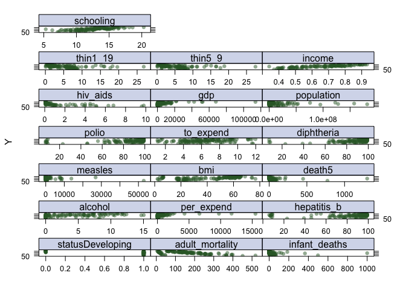

nonlinear\_regression
================
Jack Yan
4/3/2019

``` r
set.seed(123)
data = read.csv("./data/life_expectancy.csv") %>% as.tibble %>% 
  janitor::clean_names() %>% 
  na.omit() %>% 
  filter(year == 2013) %>% 
  select(-country, -year) 
data_all = read.csv("./data/life_expectancy.csv") %>% as.tibble %>% 
  janitor::clean_names() %>% 
  na.omit() %>% 
  select(-year) 
```

``` r
trRows = createDataPartition(data$life_expectancy, p = .90, list = FALSE)

train_data = data[trRows,]
test_data = data[-trRows,]
```

### Scatter Plots

``` r
# matrix of predictors
x <- model.matrix(life_expectancy~., data)[,-1]
# vector of response
y <- data$life_expectancy
```

``` r
theme1 <- trellis.par.get()
theme1$plot.symbol$col <- rgb(.2, .4, .2, .5) 
theme1$plot.symbol$pch <- 16
theme1$plot.line$col <- rgb(.8, .1, .1, 1) 
theme1$plot.line$lwd <- 2
theme1$strip.background$col <- rgb(.0, .2, .6, .2) 
trellis.par.set(theme1)

featurePlot(x, y, plot = "scatter", labels = c("","Y"),
            type = c("p"), 
            layout = c(3, 7)
            )
```



### GAM

``` r
names(data)

fit.gamm = gamm(data = data_all,
                correlation = corExp(form = ~1 | country),
                life_expectancy ~ 
                  status + s(adult_mortality) + s(infant_deaths) + s(alcohol) + s(percentage_expenditure) +
                s(hepatitis_b) + s(measles) + s(bmi) + s(under_five_deaths) + s(polio) +
                s(total_expenditure) + s(diphtheria) + s(hiv_aids) + s(gdp) + s(population) +
                s(thinness_1_19_years) + s(thinness_5_9_years) 
              )

summary(fit.gamm)

fit.gam1 = gam(data = data, 
              life_expectancy ~ 
                status + s(adult_mortality) + s(infant_deaths) + s(alcohol) + s(percentage_expenditure) +
                s(bmi) + s(under_five_deaths) +
                s(total_expenditure) + s(diphtheria) + s(hiv_aids) + s(gdp) + s(population) +
                s(thinness_1_19_years)
              )
summary(fit.gam1)

fit.gam2 = gam(data = data, 
              life_expectancy ~ 
                status + s(adult_mortality) + infant_deaths + s(alcohol) + s(percentage_expenditure) +
                s(bmi) + under_five_deaths +
                total_expenditure + diphtheria + s(hiv_aids) + gdp + s(population) +
                s(thinness_1_19_years)+ s(schooling) + s(income_composition_of_resources)
              )
summary(fit.gam2)
```

``` r
# This is the final model for GAM
fit.gam3 = gam(data = data, 
              life_expectancy ~ 
                s(adult_mortality) + s(bmi) + s(total_expenditure) + s(hiv_aids) + s(total_expenditure) +
                s(thinness_1_19_years) + s(schooling) + s(income_composition_of_resources)
              )
summary(fit.gam3)
```

    ## 
    ## Family: gaussian 
    ## Link function: identity 
    ## 
    ## Formula:
    ## life_expectancy ~ s(adult_mortality) + s(bmi) + s(total_expenditure) + 
    ##     s(hiv_aids) + s(total_expenditure) + s(thinness_1_19_years) + 
    ##     s(schooling) + s(income_composition_of_resources)
    ## 
    ## Parametric coefficients:
    ##             Estimate Std. Error t value Pr(>|t|)    
    ## (Intercept)  70.3877     0.1878   374.9   <2e-16 ***
    ## ---
    ## Signif. codes:  0 '***' 0.001 '**' 0.01 '*' 0.05 '.' 0.1 ' ' 1
    ## 
    ## Approximate significance of smooth terms:
    ##                                      edf Ref.df     F  p-value    
    ## s(adult_mortality)                 7.541  8.395 4.985 2.85e-05 ***
    ## s(bmi)                             5.892  6.986 1.478 0.184913    
    ## s(total_expenditure)               6.213  7.291 4.249 0.000385 ***
    ## s(hiv_aids)                        5.038  5.929 1.881 0.117961    
    ## s(thinness_1_19_years)             6.005  7.004 2.509 0.020142 *  
    ## s(schooling)                       3.583  4.513 2.309 0.057270 .  
    ## s(income_composition_of_resources) 8.114  8.717 7.122 1.30e-07 ***
    ## ---
    ## Signif. codes:  0 '***' 0.001 '**' 0.01 '*' 0.05 '.' 0.1 ' ' 1
    ## 
    ## R-sq.(adj) =  0.933   Deviance explained = 95.5%
    ## GCV = 6.8793  Scale est. = 4.5834    n = 130

``` r
par(mfrow = c(3, 3))
plot(fit.gam3)
```


